# PartoCalc
[](https://developer.android.com/about/versions/pie)
[](https://getbootstrap.com/docs/3.4/)
[](https://www.adobe.com/products/xd.html)
[](https://www.couchbase.com/products/mobile)
[](https://www.sqlite.org/index.html)
[](https://docs.gradle.org/current/release-notes)
[](https://www.apache.org/licenses/LICENSE-2.0)

---

### Table of Contents

- [About the project](#about-the-project)
- [Target Users](#target-users)
- [Built With](#built-with)
- [Mobile App Demo](#mobile-app-demo)
- [Getting Started](#getting-started)
- [License](#license)
- [Connect With Me](#connect-with-me)

---

## About The Project

Partograph is a composite graphical record where measurements related to maternal and fetal data including uterine contraction, cervical dilatation, fetal heart rate, blood pressure, temperature, descent of head, color of membrane and liquor, moulding of fetal skull bones, duration of labor, are plotted manually.

PartoCalc is an automated partograph generator mobile app that is operated by voice command. The app is intended for the use of nurses during the childbirth of pregnant mothers. This project was funded by [Terre des hommes](https://www.tdh.ch/en).

<p align="right"><a href="#partocalc">back to top</a></p>

---

## Target Users

1.  The pregnant women: The automated partograph will reduce the health risks of both the mother and the child.
2.  Midwives / Nurses: They will get benefit because generating partograph data will be a lot easier.
3.  Doctors: They will get more accurate access to maternal and fetal data and thus they will be able to make better medical decisions.

<p align="right"><a href="#partocalc">back to top</a></p>

---

## Built With

This section describes the languages and frameworks used for the project.

- [Java](https://www.java.com/en/)
- [Android SDK](https://developer.android.com/about/versions/pie) (version 28)
- [SQLite](https://www.sqlite.org/index.html)
- [Couchbase Mobile](https://www.couchbase.com/products/mobile)
- [Bootstrap](https://getbootstrap.com/docs/3.4/)
- [PocketSphinx](https://github.com/cmusphinx/pocketsphinx)
- [Adobe XD](https://www.adobe.com/products/xd.html)

<p align="right"><a href="#partocalc">back to top</a></p>

---
## Mobile App Demo

<table style="width:100%" class="center">
  <tr>
    <th colspan =  "100%">Simple homepage for maintaining partograph</th>
  </tr>
  <tr>
    <td>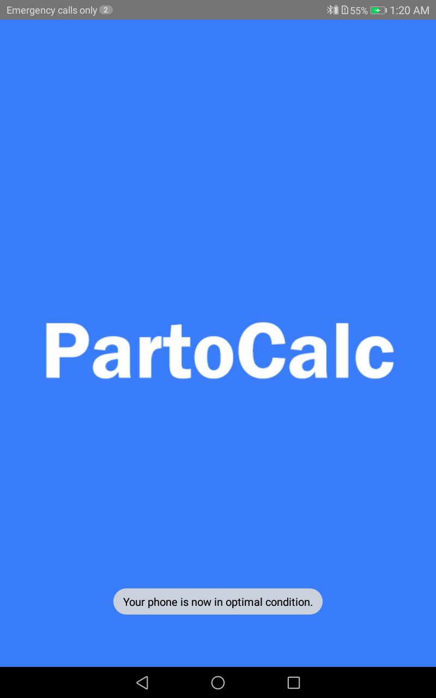</td>
    <td>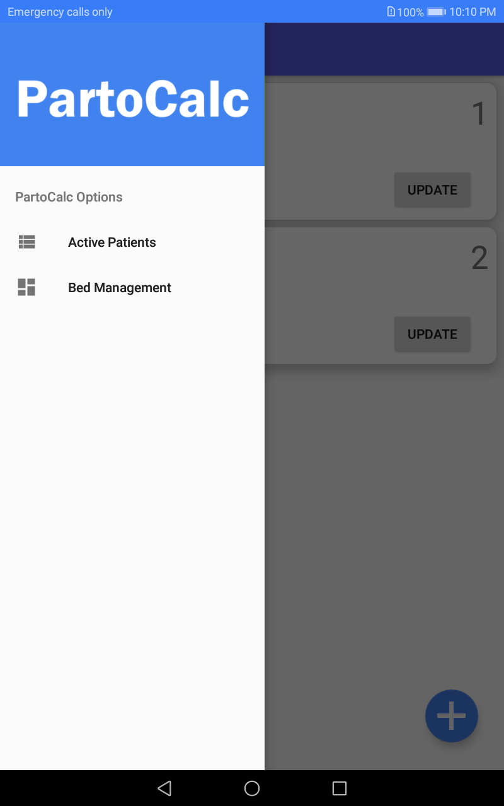</td>
  </tr>
  <tr>
    <th colspan =  "100%">Easily create a partograph for a patient!</th>
  </tr>
  <tr>
    <td>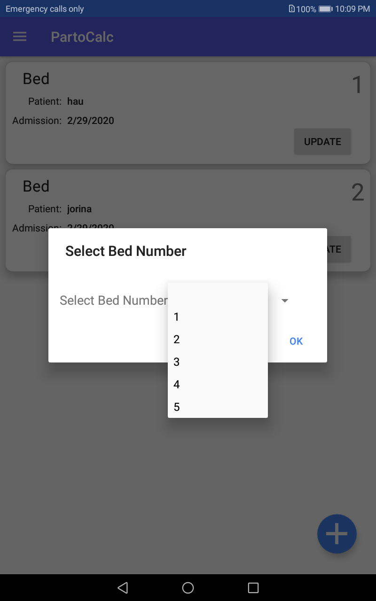</td>
    <td>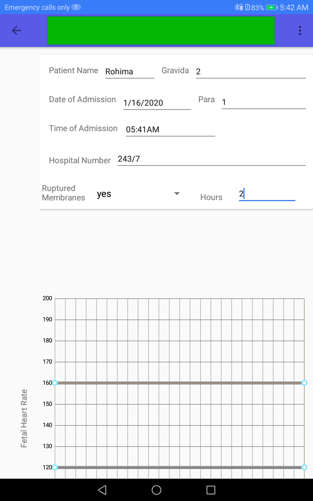</td>
  </tr>
  <tr>
    <th colspan =  "100%">Get instant emergency alert!</th>
  </tr>
  <tr>
    <td>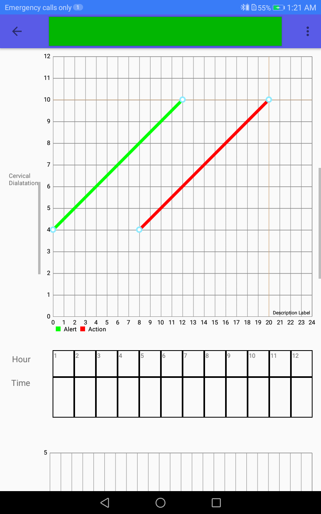</td>
    <td>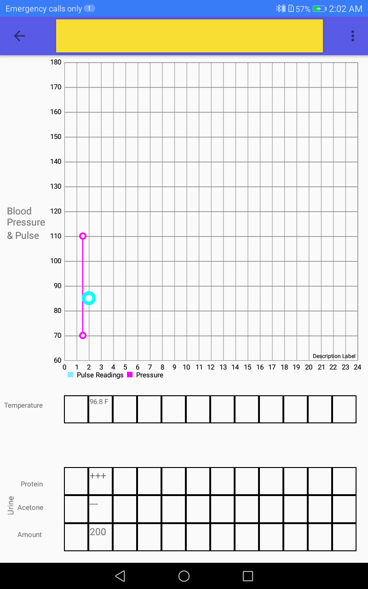</td>
  </tr>
  <tr>
    <th colspan =  "100%">Save the progress!</th>
  </tr>
  <tr>
    <td>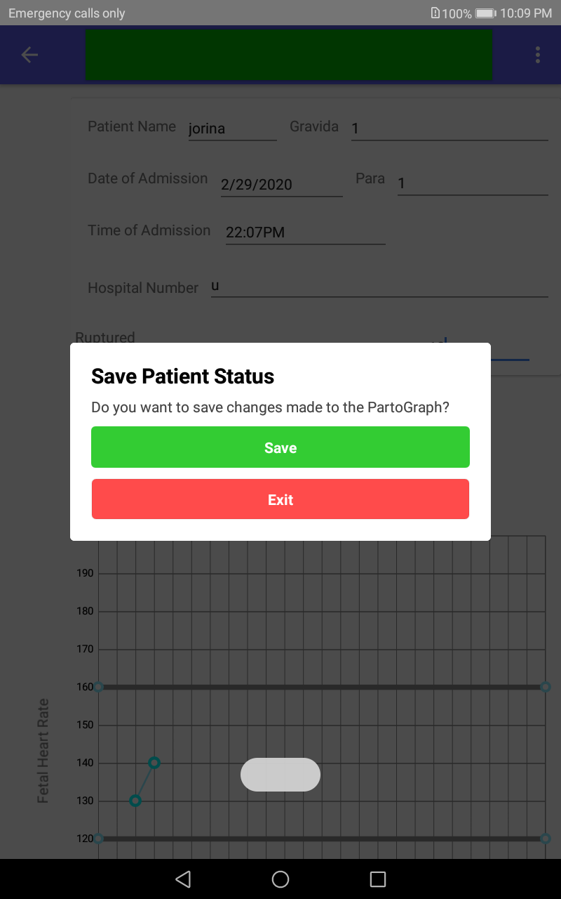</td>
    <td>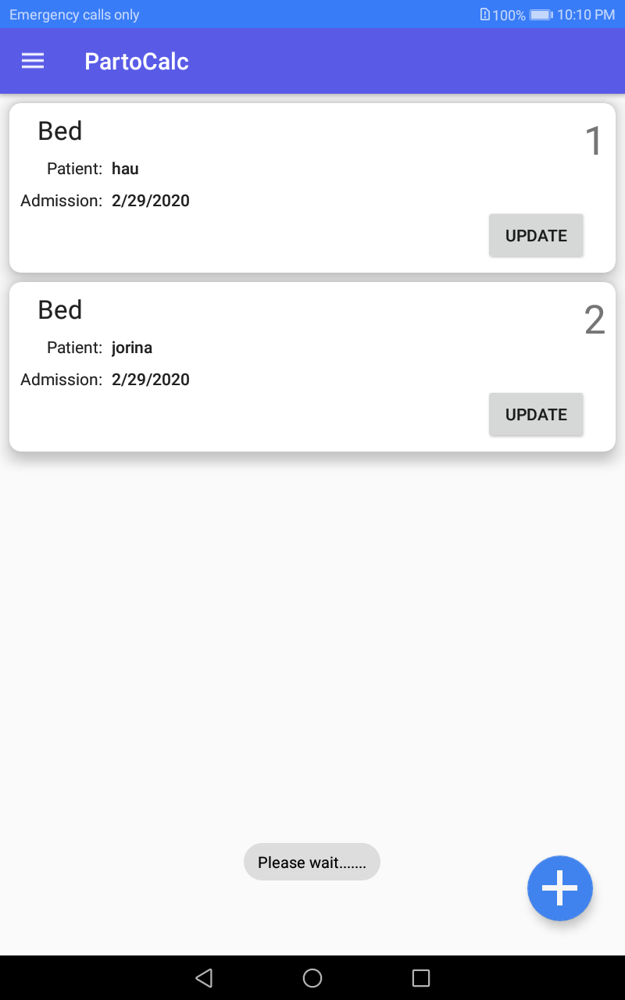</td>
  </tr>
  <tr>
    <th colspan =  "100%">Update anytime</th>
  </tr>
  <tr>
    <td>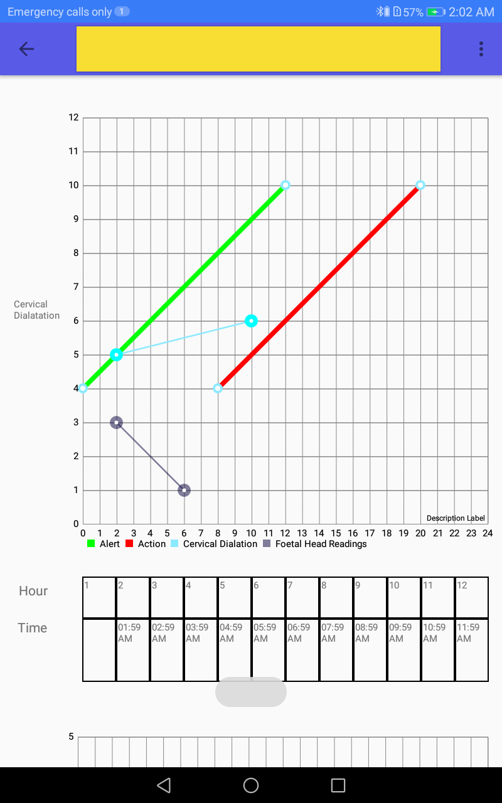</td>
    <td>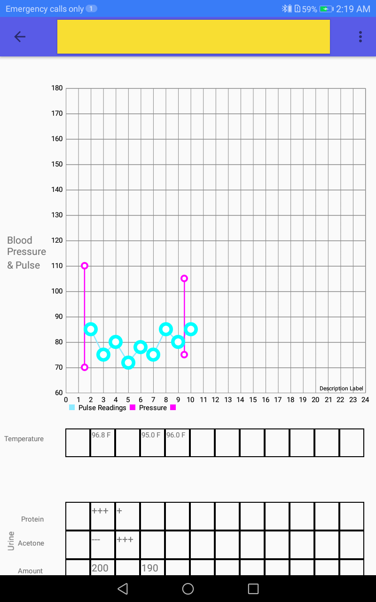</td>
  </tr>
    <tr>
    <th colspan =  "100%">Delete finished partographs</th>
  </tr>
  <tr>
    <td>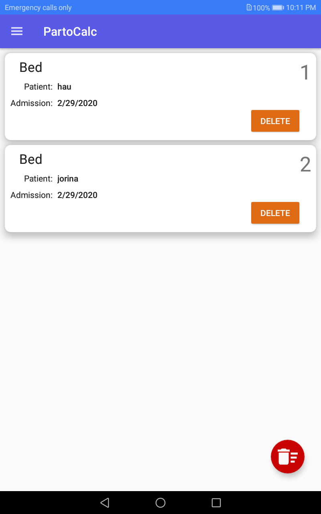</td>
    <td>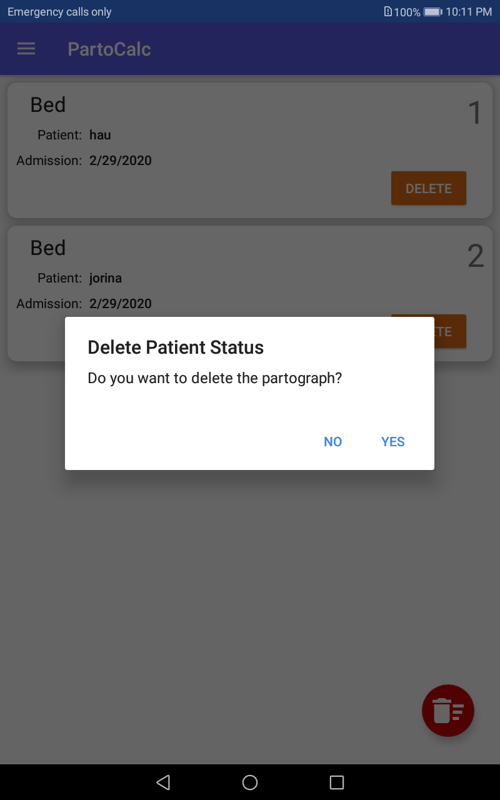</td>
  </tr>
</table>

<p align="right"><a href="#partocalc">back to top</a></p>

---

## Getting Started
### Installation

1. Download the latest app release from [here](https://github.com/Saleh-Ibtasham/PartoCalc/releases/tag/v2.0).
2. Install the apk file.

### Usage

*For detailed voice command instructions, please refer to the [Documentation](https://github.com/Saleh-Ibtasham/PartoCalc/blob/master/Documentation/PartoCalc%20User%20Manual%20v2.pdf)*

### Main Project Files
*For detailed project code overview go inside the "SPL2" folder or click [here](https://github.com/Saleh-Ibtasham/PartoCalc/tree/master/SPL2).*

<p align="right"><a href="#partocalc">back to top</a></p>

---

## License

```
    Copyright (C) [Md Saleh Ibtasham]

    Licensed under the Apache License, Version 2.0 (the "License");
    you may not use this file except in compliance with the License.
    You may obtain a copy of the License at

       http://www.apache.org/licenses/LICENSE-2.0

    Unless required by applicable law or agreed to in writing, software
    distributed under the License is distributed on an "AS IS" BASIS,
    WITHOUT WARRANTIES OR CONDITIONS OF ANY KIND, either express or implied.
    See the License for the specific language governing permissions and
    limitations under the License.
```

<p align="right"><a href="#partocalc">back to top</a></p>

---

## Connect With Me

[][website]
[][linkedin]

<p align="right"><a href="#partocalc">back to top</a></p>


[website]: https://sites.google.com/view/md-saleh-ibtasham/home
[linkedin]: https://www.linkedin.com/in/saleh-ibtasham/